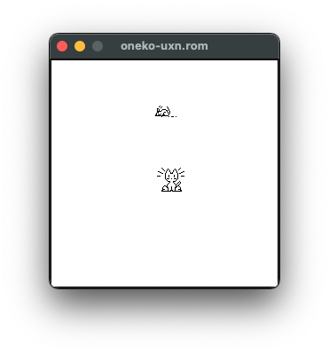

# oneko-uxn

[oneko-sakura](http://www.daidouji.com/oneko/)を[chibicc-uxn](https://github.com/lynn/chibicc)を使って[uxn](https://wiki.xxiivv.com/site/uxn.html)に移植したものです。

【警告】 `uxnemu oneko-uxn.rom`を実行しても黒い画面が表示される場合は、[ごく最近修正されたuxnemuのバグ](https://lists.sr.ht/~rabbits/public-inbox/%3C536EBE67-0820-49FF-BBAF-50FBE4DEF97%40noyu.me%3E)が原因です。回避策は、例えば `uxnemu oneko-uxn.rom -neko` のように、少なくとも1つのオプションを追加することです。

## マニュアル

> かわいい猫がマウスカーソルを追いかけるプログラム
>
> ### 書式
>
>     uxnemu oneko-uxn.rom [-help] [-tora] [-dog] [-bsd_daemon]
>                          [-bsd] [-sakura] [-tomoyo]
>                          [-time n] [-speed n] [-idle n]
>                          [-position x,y]
>                          [-rv] [-fg xxx] [-bg xxx] [-mask xxx]
>
> ### 解説
> _oneko-uxn_ を実行するとマウスカーソルはねずみとなり、そして小さなかわいい猫がそのマウスカーソルを追いかけはじめます。ねずみに追いつくと猫は眠りはじめます。
>
> ### オプション
> `-help`  
> 使い方の簡単な説明を出力します。
>
> `-tora`  
> 猫をトラ猫にします。
>
> `-dog`  
> 猫に代わり犬が走ります。
>
> `-bsd_daemon`  
> 猫に代わり 4.3BSD デーモンが走ります。
>
> `-bsd`  
> `-bsd_daemon`に同じ。
>
> `-sakura`  
> 猫に代わり木之本桜が走ります。
>
> `-tomoyo`  
> 猫に代わり大道寺知世が走ります。
>
> `-time` _interval_  
> 猫アニメーションの間隔を指定します。デフォルト値は 125000 で単位はマイクロ秒です。この値をより小さく指定すると猫はより速く走ります。
>
> `-speed` _distance_  
> 猫が一つの動作で移動する距離をドットで指定します。デフォルト値は 16 です。
>
> `-idle` _speed_  
> 逃げるねずみが猫の目を覚まさせるに至るスピードを指定します。
>
> `-position` _x_`,`_y_  
> X と Y のオフセットを指定して猫のねずみへの相対位置を調整します。
>
> `-rv`  
> 背景色と前景色を反転します。
>
> `-fg` _color_  
> 前景色。色は16進数3桁(RGB)で指定します。
>
> `-bg` _color_  
> 背景色。色は16進数3桁(RGB)で指定します。
>
> `-mask` _color_  
> マスク色。色は16進数3桁(RGB)で指定します。
>
> ### CONFIGURATION
> 設定オプションは `oneko-uxn.defaults` というファイルに書くことができます。各行には `option: value` という書式を指定します。例えば、`tora: true` でトラネコモードになります。
>
> オプション
>
> `neko`, `tora`, `dog`, `bsd_daemon`, `sakura`, `tomoyo`  
> true に設定して、キャラクターを選ぶことができます。
>
> `time`  
> アニメーションの間隔をミリ秒で設定します。
>
> `speed`  
> 移動距離をピクセルで指定します。
>
> `idle`  
> 逃げるねずみが猫の目を覚まさせるに至るスピードを指定します。
>
> `reverse`  
> 前景色と背景色を交換したい場合 true とします。
>
> `foreground`  
> 前景色。色は16進数3桁(RGB)で指定します。
>
> `background`  
> 背景色。色は16進数3桁(RGB)で指定します。
>
> `mask`  
> マスク色。色は16進数3桁(RGB)で指定します。
>
> ### 注釈
> BSD デーモンは  Marshall Kirk McKusick 氏の著作物です。すべての権利は保持されています。 BSD Daemon Copyright 1988 by Marshall Kirk McKusick. All Rights Reserved.
>
> 木之本桜および大道寺知世は漫画『カードキャプターさくら』（CLAMP, 講談社）のキャラクターであり、CLAMP 学園電子分校（[http://www.clamp.f-2.co.jp/](http://web.archive.org/web/19980515192858/http://www.clamp.f-2.co.jp/inf/)）に示されている容認のもとに利用されています。
>
> ### 作者
> オリジナルの _xneko_ は Masayuki Koba によって書かれ、そして Tatsuya Kato によって改変され _oneko_ となりました。その後 John Lerchey と Eric Anderson 、 Toshihiro Kanda 、および Kiichiroh Mukose によってさらに改変されました。hikari_no_yume によって uxn に移植されました。

oneko-uxnの歴史
====================

oneko-sakuraは Neko の数あるバージョンの一つである。系譜は、Kiichiroh Mukose 他によるoneko-sakura（[README](http://www.daidouji.com/oneko/distfiles/README)） ← Tatsuya Kato 他によるoneko（[歴史サイト](https://web.archive.org/web/20010502181733/http://hp.vector.co.jp/authors/VA004959/oneko/nekohist.html)） ← Masayuki Koba による xneko.
オリジナルはnaoshi（若田部直）氏のNeko.COMで、[ウィキペディア](https://ja.wikipedia.org/wiki/Neko_(%E3%82%BD%E3%83%95%E3%83%88%E3%82%A6%E3%82%A7%E3%82%A2))を参照してください。

この移植版は <http://www.daidouji.com/oneko/distfiles/oneko-1.2.sakura.5.tar.gz> にある `oneko-1.2.sakura.5` を基にしています。未修正のコピーは `original/oneko-1.2.sakura.5.tar.gz` に含まれています。`original/`ディレクトリには、読みやすいようにUTF-8に変換されたオリジナルのドキュメントファイルも含まれています。

この移植は私、[hikari\_no\_yume](https://hikari.noyu.me/)によるものです。chibicc-uxnを使ってちゃんとしたアプリケーションを移植してみたかった。

oneko-sakuraとの違い
-------------------------

diffはこちらです。 <https://github.com/hikari-no-yume/oneko-uxn/compare/original-UTF-8..trunk>

### 新機能

* `-mask` で猫とカーソルのマスクに背景と異なる色を与えることができます。

### 変更された機能

* `-fg`/`-foreground` と `-bg`/`-background` では、uxnの3桁の16進数カラーコードを使用します。例えば `f77` はピンク (#ff7777).
* `-time` はマイクロ秒ではなくミリ秒で指定します。
* 終了のショートカットを Alt-Q から Ctrl-Q に変更しました。
* uxn/varvaraには`.Xresources`に相当するものがないので、代わりに`oneko-uxn.defaults`ファイルに以下のように設定を入れます。

      foreground: f70
      background: black
      speed: 10
      tora: true

### 削除された機能

* uxn/varvaraはウィンドウシステムを内蔵していないため、この移植版ではnekoはウィンドウの中に閉じ込められ、他のウィンドウを追うことができません。この点ではオリジナルの xneko と同じです。
* `-name` （ウィンドウ名のカスタマイズ）。技術的には varvara メタデータ・ポートでサポートできるかもしれないが、動的な名前を意図していないようです。
* uxn/varvara はアプリケーションがウィンドウを表示するディスプレイを選べないため `-display` は削除されました。
* `-debug` は X の synchronize というuxn には関係のない機能を使っていたので、削除されました。
