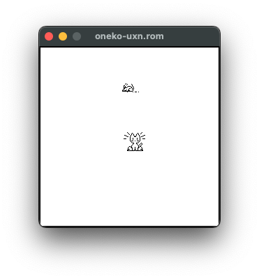

oneko-uxn
=========

[日本語版 README はこちら](./README-ja.md)

This is a port of [oneko-sakura](http://www.daidouji.com/oneko/) to [uxn](https://wiki.xxiivv.com/site/uxn.html) using [chibicc-uxn](https://github.com/lynn/chibicc).

[Download the uxn ROM here](https://github.com/hikari-no-yume/oneko-uxn/releases/download/1.2.sakura.5.uxn.1/1.2.sakura.5.uxn.1.zip)

Warning: If you run `uxnemu oneko-uxn.rom` and just get a black screen, this is due to [a bug in uxnemu that was only fixed very recently](https://lists.sr.ht/~rabbits/public-inbox/%3C536EBE67-0820-49FF-BBAF-50FBE4DFEF97%40noyu.me%3E). The workaround is to add at least one option, e.g. `uxnemu oneko-uxn.rom -neko`.

Manual
------

> The program oneko creates a cute cat chasing around your mouse cursor.
>
> ### SYNOPSIS
>
>     uxnemu oneko-uxn.rom [-help] [-tora] [-dog] [-bsd_daemon]
>                          [-bsd] [-sakura] [-tomoyo]
>                          [-time n] [-speed n] [-idle n]
>                          [-position x,y]
>                          [-rv] [-fg xxx] [-bg xxx] [-mask xxx]
>
> ### DESCRIPTION
> _oneko-uxn_ changes your mouse cursor into mouse and creates a little cute cat and the cat start chasing around your mouse cursor.  If the cat catchup the “mouse”, start sleeping.
>
> ### OPTIONS
> `-help`  
> Prints help message on usage.
>
> `-tora`  
> Make cat into "tora-neko".  "Tora-neko" means cat with tiger-like stripe.
>
> `-dog`  
> Runs a dog instead of a cat.
>
> `-bsd_daemon`  
> Runs a 4.3BSD daemon instead of a cat.
>
> `-bsd`  
> Same as `-bsd_daemon`.
>
> `-sakura`  
> Runs Sakura Kinomoto instead of a cat.
>
> `-tomoyo`  
> Runs Tomoyo Daidouji instead of a cat.
>
> `-time` _interval_  
> Sets interval timer which determine intervals for cat animation.  Default value is 125 and unit is milli-second.  Smaller value makes cat run faster.
>
> `-speed` _distance_  
> Specify the distance where cat jumps at one move in dot resolution.  Default is 16.
>
> `-idle` _speed_  
> Specify the threshold of the speed which “mouse” running away to wake cat up.
>
> `-size` _width_`x`_height_  
> Specify width and height of window in pixels.
>
> `-position` _x_`,`_y_  
> Specify X and Y offsets in pixels to adjust position of cat relative to mouse pointer.
>
> `-rv`  
> Reverse background color and foreground color.
>
> `-fg` _color_  
> Foreground color. Color is three hexadecimal digits (RGB).
>
> `-bg` _color_  
> Background color. Color is three hexadecimal digits (RGB).
>
> `-mask` _color_  
> Mask color. Color is three hexadecimal digits (RGB).
>
> ### CONFIGURATION
> You can put configuration options in a file called `oneko-uxn.defaults`. Each line should have the format `option: value`, for example `tora: true` for tora-neko mode.
>
> Options:
>
> `neko`, `tora`, `dog`, `bsd_daemon`, `sakura`, `tomoyo`  
> Set one of these to “true” to pick a character.
>
> `time`  
> Sets interval timer in milli-second.
>
> `speed`  
> Sets distance to jump in pixel.
>
> `idle`  
> Sets speed threshold to wake cat up when ``mouse'' running away.
>
> `size`  
> Sets width and height of window in pixels. Width and height should be separated by `x`.
>
> `position`  
> Sets X and Y offsets in pixels to adjust position of cat relative to mouse pointer. Offsets should be separated by comma (`,`).
>
> `reverse`  
> Set “true” if you want to switch foreground and background color.
>
> `foreground`  
> Foreground color. Color is three hexadecimal digits (RGB).
>
> `background`  
> Background color. Color is three hexadecimal digits (RGB).
>
> `mask`  
> Mask color. Color is three hexadecimal digits (RGB).
>
> ### ACKNOWLEDGEMENTS
> BSD Daemon Copyright 1988 by Marshall Kirk McKusick. All Rights Reserved.
>
> Sakura Kinomoto and Tomoyo Daidouji are characters in a comic strip "CARDCAPTOR SAKURA" (CLAMP, Kodansha), with the sanction indicated in CLAMP SCHOOL WEB CAMPUS (http://www.clamp.f-2.co.jp/).
>
> ### AUTHOR
> Original _xneko_ is written by Masayuki Koba and modified to _oneko_ by Tatsuya Kato, and modified furthermore by John Lerchey, Eric Anderson, Toshihiro Kanda and Kiichiroh Mukose. Port to uxn by hikari_no_yume.

History of oneko-uxn
====================

oneko-sakura is one of the many versions of “Neko”. Lineage: oneko-sakura by Kiichiroh Mukose et al (see [README](http://www.daidouji.com/oneko/distfiles/README)) ← oneko by Tatsuya Kato et al (see [history website](https://web.archive.org/web/20010502181733/http://hp.vector.co.jp/authors/VA004959/oneko/nekohist.html)) ← xneko by Masayuki Koba. The original Neko is Neko.COM by naoshi, see [Japanese Wikipedia](https://ja.wikipedia.org/wiki/Neko_(%E3%82%BD%E3%83%95%E3%83%88%E3%82%A6%E3%82%A7%E3%82%A2)).

This port is based on version `oneko-1.2.sakura.5` from <http://www.daidouji.com/oneko/distfiles/oneko-1.2.sakura.5.tar.gz>. An unmodified copy is included at `original/oneko-1.2.sakura.5.tar.gz`. The `original/` directory also contains the original documentation files, converted to UTF-8 for easier reading.

This port is by me, [hikari\_no\_yume](https://hikari.noyu.me/). I helped create chibicc-uxn and wanted to try using it to port a “real” application.

Changes from oneko-sakura
-------------------------

You can see a diff here: <https://github.com/hikari-no-yume/oneko-uxn/compare/original-UTF-8..trunk>.

New features:

* `-mask` lets you give the neko/cursor mask a different color to the background.
* `-size` lets you change the window size.
* `position` setting can be loaded from the defaults file (not just set with `-position` option).

Changed features:

* The cursor colors were inverted. This was an accident, but I think some of the cursors look better this way, and it matches the original xneko.
* `-fg`/`-foreground` and `-bg`/`-background` use uxn-style 3-digit hex colours (e.g. `f77` for pink #ff7777).
* `-time` now takes milliseconds rather than microseconds.
* `-position` uses a slightly different syntax.
* The quit shortcut is Ctrl-Q rather than Alt-Q because the latter doesn't work for me on macOS.
* uxn/varvara does not have an equivalent of `.Xresources`, so instead configuration goes in an `oneko-uxn.defaults` file. An example file:

      foreground: f70
      background: black
      speed: 10
      tora: true

Removed features:

* uxn/varvara does not have a built-in windowing system, so in this port, the neko is stuck inside the window and can't follow other windows. In this way it is like the original xneko.
* `-name` (customizing the window name). Technically this could be supported with the varvara metadata port, but it does not seem to be intended for dynamic names.
* `-display`, because uxn/varvara does not let the application pick which display the window appears on.
* `-debug`, because it used some "synchronize" X feature that is not relevant to uxn.
